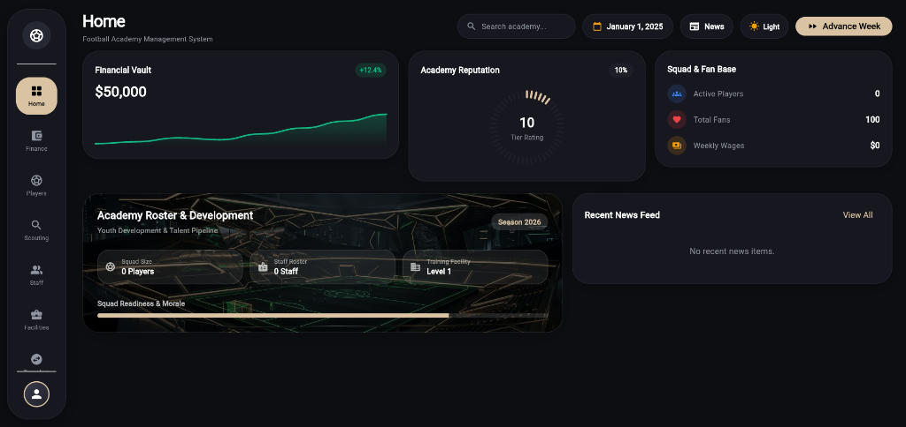

# ⚽ Football Academy Manager

<p align="center">
  
</p>

<p align="center">
  <strong>A cutting-edge, turn-based Football Academy Management Simulation built with Flutter.</strong><br>
  Featuring a high-tech <em>Futuristic Neumorphic Capsule</em> UI, AI-powered transfer market, dynamic player training, and multi-tier tournament progression.
</p>

<p align="center">
  
  
  
  
</p>

---



---

## 🌟 Overview & Aesthetic Vision

**Football Academy Manager** combines deep strategic simulation mechanics with an extraordinary visual aesthetic. As the Director of a youth football academy, you are tasked with building an elite institution from the ground up—scouting prospects, expanding high-tech facilities, hiring coaching staff, competing in global youth tournaments, and navigating dynamic transfer markets.

### 🎨 The Futuristic Neumorphic Capsule UI
- **Luxury Dark Obsidian Palette**: Deep space black (`#0D0E12`) canvas paired with warm champagne gold (`#D9C3A3`), emerald green (`#10B981`), and neon status indicators.
- **Capsule Navigation Sidebar**: Floating rounded pill navigation for seamless tab navigation.
- **Interactive Visual Data Widgets**:
  - **Financial Vault Sparkline**: Smooth cubic spline chart tracking budget trajectories.
  - **Academy Reputation Spoke Ring**: Radial progress indicator reflecting tier standing.
  - **Player Radar Charts**: Attribute distribution spider maps across 5 core tactical pillars.
  - **Roster & Readiness Showcase**: Glassmorphic cards monitoring facility levels, morale, and squad capacity.

---

## 🖼️ Custom AI Visual Asset Suite

The application features a curated suite of AI-generated dark-mode assets designed to harmonize with the capsule aesthetic:

| Asset | Preview | Location & Purpose |
|---|---|---|
| **Academy Emblem Logo** | `assets/images/game_logo.png` | **Start Screen & App Header**: Minimalist champagne-gold 3D metallic shield badge. |
| **Start Screen Backdrop** | `assets/images/start_hero_banner.png` | **Start Screen Ambient Glow**: Panoramic futuristic stadium arena at night. |
| **Stadium Abstract Hero** | `assets/images/stadium_abstract.png` | **Dashboard Showcase**: Architectural stadium lights & glowing emerald pitch. |
| **Infrastructure Compound** | `assets/images/facility_stadium.png` | **Facilities Hub**: Geometric dark training facility complex. |
| **Scouting Network Map** | `assets/images/scouting_prospect.png` | **Scouting Network**: Holographic tactical pitch map with target reticles. |
| **Championship Trophy** | `assets/images/trophy_cup.png` | **Tournaments Hub**: Titanium and champagne-gold championship trophy. |
| **Transfer Hub Network** | `assets/images/transfer_hub_banner.png` | **Transfer Hub**: Global player transfer market HUD visualization. |

---

## ⚙️ Core Gameplay & Managerial Mechanics

### 1. 📋 Weekly Simulation Loop
The game progresses week-by-week. Advancing the week simulates:
- **Match Engine**: Calculates outcome, goal scorers, assists, yellow/red cards, and fatigue.
- **Player Development**: Attribute gains based on coach skill, facility level, and training focus.
- **Financial Balance**: Payout of player/staff wages, ticket revenue, merchandise profits, and facility maintenance.
- **Scouting Network**: Uncovers raw youth prospects with variable potential rating caps.
- **Transfer Negotiations**: AI clubs evaluate your players and send real-time monetary transfer bids.

### 2. 🧢 Staff & Facility Management
- **Staff Roles**: Hire Managers, Coaches, Scouts, Physios, and Merchandise Managers.
- **Facility Upgrades**:
  - **Training Facility**: Boosts coaching capacity and player stat growth velocity.
  - **Scouting HQ**: Increases scout capacity and prospect rating accuracy.
  - **Medical Bay**: Reduces recovery time for fatigued and injured players.
  - **Merchandise Store**: Unlocks retail revenue streams and grows fan base.

### 3. ⚽ Competitions & Pro Youth Leagues
- **Knockout & League Formats**: Compete across **3v3, 5v5, 7v7, and 11v11** game modes.
- **Pro Youth League Pyramid**: Climb through Tier 3, Tier 2, and Tier 1 Pro Youth Leagues against AI professional clubs with promotion/relegation rules.

---

## 🛠️ Architecture & Technical Stack

```
lib/
 ├── models/                 # Data schemas (Player, Staff, Match, Tournament, AIClub)
 ├── screens/                # UI Screens (Dashboard, Start, Facilities, Scouting, Transfers, etc.)
 ├── services/               # Engine services (Finance, Scouting, Match Simulator)
 ├── utils/                  # AppTheme tokens & Name Generators
 ├── widgets/                # Reusable Capsule components (Radar Charts, Sparklines, Header Bars)
 ├── game_state_manager.dart # Main State Provider (Notifier pattern & Web/Native persistence)
 └── main.dart               # App entrypoint
```

- **Framework**: [Flutter](https://flutter.dev/) (Cross-platform support: Web, Windows, macOS, Android, iOS)
- **State Management**: `Provider` architecture with reactive state consumers
- **Design System**: Material 3 base with custom `AppTheme` tokens and canvas painters
- **Persistence**: `shared_preferences` & `path_provider` for cross-platform local saves

---

## 🚀 Getting Started

### Prerequisites
- [Flutter SDK](https://docs.flutter.dev/get-started/install) (`^3.24.0` or later)
- Dart SDK (`^3.5.0` or later)

### Quick Run
```bash
# Clone the repository
git clone https://github.com/x-Kevin-Paul-x/Football-academy-game.git

# Navigate to project directory
cd Football-academy-game

# Fetch Flutter dependencies
flutter pub get

# Launch on connected device or browser
flutter run
```

---

## 📄 License

This project is licensed under the MIT License — see the `LICENSE` file for details.
